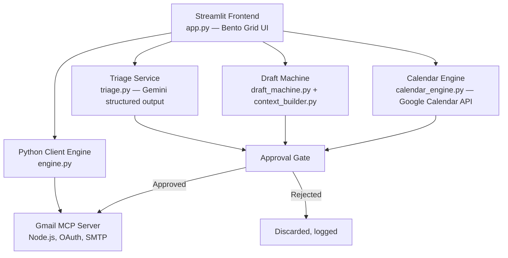
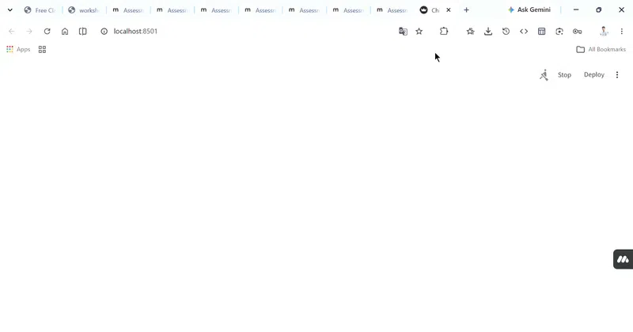

<div align="center">

# 🗂️ AI Chief of Staff — Gmail Triage, Ghostwriting & Calendar Assistant

### A human-in-the-loop AI workspace that triages your inbox, drafts replies in your voice, and books meetings — and never sends anything without your sign-off


<sub>Real product screenshot — Active Threads Feed, Draft Review, and Calendar Context in one workspace.</sub>

</div>

---

## TL;DR

Inbox triage, drafting replies, and finding a meeting slot are three different mental modes that most people context-switch between all day. **AI Chief of Staff** collapses them into one pipeline: it pulls your Gmail threads via a local MCP server, classifies each by priority with Gemini, ghostwrites replies in your actual voice (not generic AI tone), and extracts meeting requests into bookable calendar slots — but every single send or booking sits behind an explicit **Approval Gate**. Nothing leaves the app without a human clicking approve.

**My role:** Sole builder — architecture, prompt design for triage/drafting/calendar extraction, the human-in-the-loop approval workflow, and the full Streamlit UI, end to end.

---

## 📖 Table of Contents

- [The Problem](#-the-problem)
- [The Solution](#-the-solution)
- [Architecture](#️-architecture)
- [Human-in-the-Loop by Design](#-human-in-the-loop-by-design)
- [Prompt Design](#️-prompt-design)
- [Reliability & Fallback](#-reliability--fallback)
- [Product Walkthrough](#-product-walkthrough)
- [Tech Stack](#-tech-stack)
- [Setup](#-setup)
- [Deploying to Streamlit Cloud](#️-deploying-to-streamlit-community-cloud)
- [Security & Privacy](#-security--privacy)
- [Repo Structure](#-repo-structure)
- [Product Decisions & Learnings](#-product-decisions--learnings)

---

## 🔍 The Problem

Managing a busy inbox alongside a calendar means constantly switching between three separate jobs: figuring out what actually needs a response today, writing that response in a voice that sounds like you (not a generic AI), and finding a time slot that works for a proposed meeting buried three replies deep in a thread. Doing all three manually, every day, is where inboxes go to die.

## 💡 The Solution

AI Chief of Staff runs a single pipeline across all three jobs:

1. **Fetch** — pulls live Gmail threads through a local Model Context Protocol (MCP) server, or falls back to sample/mock threads for demoing
2. **Triage** — classifies each thread as `urgent`, `needs-reply`, `fyi`, or `ignore` via Gemini, with a category tag and a one-line reason
3. **Draft** — generates reply drafts only for actionable threads (urgent/needs-reply), ghostwritten in a configurable tone profile with adjustable Formality and Directness
4. **Extract meetings** — scans threads for meeting requests and proposes concrete bookable time slots, resolved against calendar free/busy data
5. **Approve** — every draft and every calendar booking waits at an Approval Gate for explicit human sign-off before anything is sent or booked

---

## 🏗️ Architecture



The frontend never talks to Gmail directly — everything routes through a local Node.js **MCP server** that owns OAuth, SMTP, and Calendar API access, communicating with the Python side over JSON-RPC via subprocess/stdio. This keeps credential handling isolated from the UI layer entirely.

---

## 🛑 Human-in-the-Loop by Design

The single most important product decision in this project: **no email is ever sent and no meeting is ever booked automatically.**

Every generated draft moves through explicit states — `pending → approved / rejected → sent` — tracked in session state and surfaced as status badges in the UI. Approving a draft doesn't send it either; it stages it at the **Approval Gate**, where a "Draft Desk" proof document (Markdown + HTML) is generated summarizing every approved draft before final send.

This wasn't a limitation I worked around — it was the starting design constraint. An AI system with **write access to someone's email and calendar** is exactly the kind of feature where "mostly right" isn't good enough, and where trust is the actual product being built, not just the automation.

---

## ✍️ Prompt Design

Two of the three AI features here are genuinely interesting prompt engineering problems, not just "ask Gemini a question."

### Triage — schema-locked classification

```python
class TriageResult(BaseModel):
    priority: str   # "urgent" | "needs-reply" | "fyi" | "ignore"
    category: str   # meeting-request | follow-up | newsletter | billing | job-app | social | admin
    reason: str      # one sentence explaining why
```

The prompt itself is short (sender, subject, preview + classification instructions) because the **schema does the heavy lifting** — Gemini's `response_schema` guarantees valid, parseable JSON every time, so the app never has to defensively parse free-text classification output.

### Draft Ghostwriter — persona injection + few-shot voice matching

Rather than a single static prompt, the system prompt is **assembled per-request** from a tone profile and past reply examples:

```text
You are a ghostwriter drafting email replies on behalf of {name}, a {role}.
- Tone: {tone}
- Formality level: {formality}
- Default sign-off: "{sign_off}"

## Writing Rules
{numbered quirks from tone_profile.json}

Preferred vocabulary: {vocab.use}
Avoid these phrases: {vocab.avoid}
```

Combined with hard drafting constraints layered on top — a **one-ask rule** (every email makes exactly one request), a 5-sentence length cap, mandatory paragraph spacing, and an explicit ban on AI filler phrases like *"I hope this finds you well"* — this is less "write an email" and more a tightly specified contract for what a passable draft looks like.

**Why the constraints matter:** early drafts without the one-ask rule and filler-phrase ban were technically fine but immediately recognizable as AI-written — verbose, hedge-y, and asking multiple things at once. The rules exist because of specific failure modes observed, not as a generic best-practice checklist.

### Calendar extraction — grounding relative time

The meeting-parser prompt explicitly passes **today's date** so Gemini can resolve "tomorrow" or "next Wed at 3pm" into precise ISO timestamps, with a default timezone assumption when none is stated — a small but easy-to-miss detail that breaks calendar extraction completely if skipped.

---

## 🛡 Reliability & Fallback

Every AI call in this system follows the same layered pattern also used in my [Morning Digest](https://github.com/Rehansheikh787/Daily-Morning-Digest-news) and [RupeeRadar](https://github.com/Rehansheikh787/Rupee-Radar-) projects:

```
Gemini (primary) → Groq (fallback) → Deterministic local fallback
```

- **Rate-limit aware:** triage batches requests (4 at a time) with a deliberate pause to stay within Gemini's free-tier quota, rather than firing all requests at once and eating 429 errors
- **Retry with backoff:** calendar extraction retries transient failures before falling through to Groq
- **Never blank:** if every API is unavailable, draft generation falls back to a rule-based local drafter that still respects the user's tone profile and sign-off — the app degrades, it doesn't break

---

## 📱 Product Walkthrough

**Welcome & authentication flow** — guided OAuth setup with credential validation:


**Unified triage & agenda dashboard** — active threads, draft review, and today's calendar context in one view:


**Live usage demo:**



---

## 🛠 Tech Stack

| Layer | Choice |
|---|---|
| Frontend | Streamlit (custom Bento Grid dark-mode UI) |
| AI | Google Gemini 2.5 Flash (primary), Groq Llama 3.3 70B (fallback) |
| Integration | Model Context Protocol (MCP) — local Node.js Gmail server |
| Calendar | Google Calendar API (FreeBusy, event creation) |
| Auth | Google OAuth Desktop Client, scope-relaxed guided setup |
| Structured Output | Pydantic schemas enforced via Gemini `response_schema` |

---

## 🚀 Setup

### Prerequisites
- Python 3.12+
- Node.js 18+ (with npm)
- Google Cloud Console OAuth Desktop credentials
- Gemini API key (Google AI Studio)

```bash
git clone https://github.com/Rehansheikh787/Cheif-of-staff-Ai.git
cd Cheif-of-staff-Ai

# Configure environment
# create .env in the root directory:
#   GEMINI_API_KEY=your_gemini_api_key_here
#   DISABLE_RATE_LIMIT_PAUSE=true

python -m venv .venv
source .venv/bin/activate   # Windows: .venv\Scripts\activate
pip install -r requirements.txt

streamlit run app.py
```

---

## ☁️ Deploying to Streamlit Community Cloud

Fully optimized for container deployment:

1. **`packages.txt`** installs `nodejs` and `npm` system binaries inside Streamlit's Linux environment
2. **First-run self-healing** — Python automatically runs `npm install` inside `gmail-mcp-server/` to fetch Node dependencies
3. **Streamlit Secrets** — set `GEMINI_API_KEY` and `DISABLE_RATE_LIMIT_PAUSE` in the deployment's Secrets panel

---

## 🔒 Security & Privacy

- `.env`, `credentials.json`, and `token.json` are globally `.gitignore`'d — OAuth tokens and API secrets are never committed
- Communication with Google APIs is piped through standard input/output using JSON-RPC, keeping access keys isolated inside the MCP subprocess context rather than exposed to the frontend

---

## 📁 Repo Structure

```
Cheif-of-staff-Ai/
├── app.py                  Streamlit frontend — Bento Grid UI, pipeline orchestration, Approval Gate
├── engine.py                Python client engine — spawns and syncs with the Gmail MCP server
├── triage.py (gmail-mcp-server/)   Gemini-based priority classification, schema-locked
├── draft_machine.py         Reply ghostwriting — Gemini → Groq → local fallback
├── context_builder.py       Assembles persona + few-shot system prompts from tone_profile.json
├── calendar_engine.py       Meeting extraction, FreeBusy checks, event creation
├── gmail-mcp-server/         Node.js MCP server — Gmail OAuth, SMTP, Calendar API
├── tone_profile.json         User's voice: tone, formality, quirks, vocabulary preferences
├── sample_threads.json       Demo data for running without a live Gmail connection
└── media/                    Screenshots and demo video used above
```

---

## 🎓 Product Decisions & Learnings

- **Trust is the feature, not a constraint on it** — the Approval Gate wasn't scoped in after the fact; it was the first design decision, because write access to email/calendar makes "human never reviews this" an unacceptable default
- **Constraints beat instructions for voice-matching** — a persona description alone produced generic AI writing; explicit rules (one-ask, length cap, banned filler phrases) derived from actually observing bad outputs are what made drafts sound human
- **Schema-locked output removes a whole class of bugs** — letting Gemini's `response_schema` guarantee valid JSON meant the triage pipeline never needed defensive text-parsing logic
- **Free-tier constraints are a product constraint, not just an ops detail** — batching and pausing around Gemini's rate limit was a deliberate design choice to keep the demo usable without a paid tier, not an afterthought
- **Consistent reliability pattern across projects** — the Gemini → Groq → local-fallback layering here matches the same pattern in my other AI projects; it's become a default instinct rather than a one-off decision

---

<div align="center">

I'm a **Chemical Engineer transitioning into AI Product Management**, and I build complete, working AI-native products like this one — including the parts that are easy to skip, like approval workflows and graceful degradation — to learn product thinking by doing.

📂 More case studies and projects on my [GitHub profile](https://github.com/Rehansheikh787).

</div>
