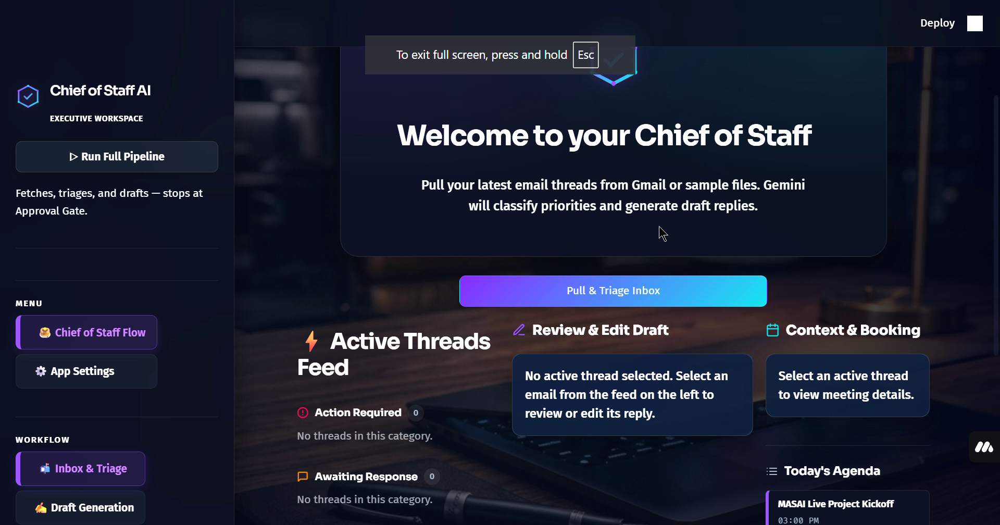
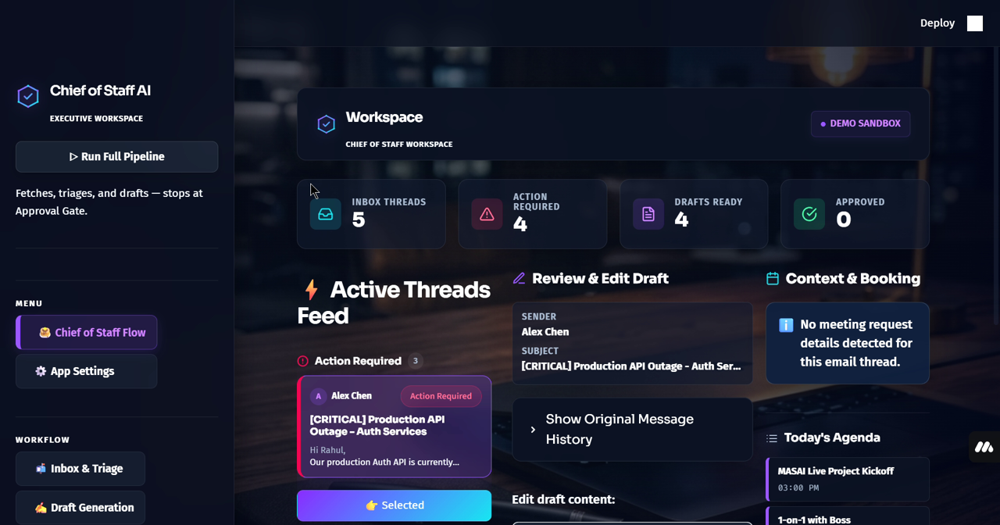

# 🗄️ AI Chief of Staff — Gmail Inbox Triage & Calendar Assistant

An elegant, production-ready AI-powered email triage and calendar management dashboard built with **Streamlit**, **Google Gemini**, and a local **Model Context Protocol (MCP)** server. It automatically fetches, triages, and draft replies to your emails while managing your day's schedule from a unified, premium dark-mode workspace.

---

## 🌟 Visual Showcase

### Welcome Screen & Authentication Flow


### Unified Triage & Agenda Dashboard


### Live Usage Demo
[](https://raw.githubusercontent.com/Rehansheikh787/Cheif-of-staff-Ai/main/media/github-demo-merged.mp4)

---

## ✨ Features

- **📬 Inbox & Triage**: Automatically fetches and categorizes your latest email threads into actionable priority buckets (`urgent`, `needs-reply`, `fyi`, `ignore`) using the Gemini 2.5 Flash model.
- **🗓️ Today's Agenda Feed**: Real-time integration with Google Calendar API that fetches, displays, and shifts your daily schedule into your local system timezone.
- **✍️ AI Reply Ghostwriter**: Generates contextual draft replies for emails needing attention. Adjust draft tone profiles dynamically with Formality and Directness sliders.
- **🔐 Resilient Authentication**: Guided step-by-step setup in the UI with strict uploader validation, credentials protection, and scope-relaxed OAuth logic.
- **🔍 Connection Diagnostics**: Instant testing utility for Google Calendar connection validity, retrieving FreeBusy slots to ensure correct configuration.
- **📋 Action Logs**: Persistent action histories recording all sent emails and booked events with local system timezones and dates.

---

## 🛠️ Architecture

The project utilizes a multi-layered Model Context Protocol (MCP) architecture:

```
  Streamlit Frontend (app.py)
    ├── Unified Bento Grid UI
    ├── Local Timezone and Date conversions
    └── Communicates via subprocess with MCP Client
         │
         ▼
  Python Client Engine (engine.py)
    ├── Auto-installs Node.js dependencies
    ├── Synchronizes authorized tokens
    └── Spawns Node.js Gmail MCP server
         │
         ▼
  Gmail MCP Server (gmail-mcp-server)
    ├── Connects to Google OAuth & APIs
    └── Handles secure SMTP & Calendar queries
```

---

## 🚀 Getting Started

### Prerequisites
- **Python 3.12+**
- **Node.js 18+** (with npm)
- **Google Cloud Console Credentials** (OAuth Desktop Client credentials)
- **Gemini API Key** (from Google AI Studio)

### Installation & Local Setup

1. **Clone the Repository:**
   ```bash
   git clone https://github.com/Rehansheikh787/Cheif-of-staff-Ai.git
   cd Cheif-of-staff-Ai
   ```

2. **Configure Environment Variables:**
   Create a `.env` file in the root directory:
   ```env
   GEMINI_API_KEY=your_gemini_api_key_here
   DISABLE_RATE_LIMIT_PAUSE=true
   ```

3. **Install Dependencies:**
   Install Python dependencies in a virtual environment:
   ```bash
   python -m venv .venv
   source .venv/bin/activate  # On Windows: .venv\Scripts\activate
   pip install -r requirements.txt
   ```

4. **Launch the Dashboard:**
   ```bash
   streamlit run app.py
   ```

---

## ☁️ Deploying to Streamlit Community Cloud

This project is fully optimized for container deployment on Streamlit Community Cloud.

1. **System Packages (`packages.txt`)**: The repository contains a `packages.txt` file which installs `nodejs` and `npm` system binaries inside Streamlit's Linux environment.
2. **First-run Self-Healing**: When first booted, Python will automatically run `npm install` inside the `gmail-mcp-server` directory to fetch Node dependencies.
3. **Streamlit Secrets**: Define your credentials in the **Secrets** panel of your Streamlit deployment:
   ```toml
   GEMINI_API_KEY = "your_actual_gemini_api_key"
   DISABLE_RATE_LIMIT_PAUSE = "true"
   ```

---

## 🔒 Security & Privacy

- **Safe Git exclusion**: `.env`, `credentials.json`, and `token.json` are globally ignored via `.gitignore`. Your private keys, OAuth tokens, and Google API secrets will **never** be committed to GitHub.
- **Subprocess Isolation**: Communication with Google APIs is piped securely through standard input/output using JSON-RPC, keeping access keys private inside the process context.
